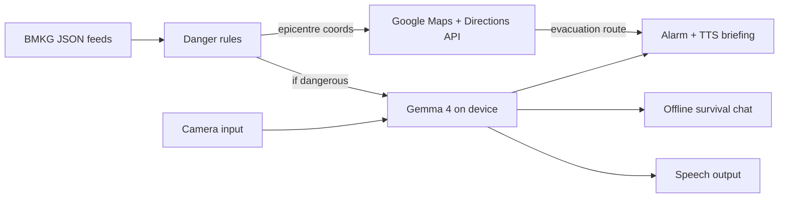

# Prometheus

On-device disaster awareness for Indonesia. The app combines **BMKG open data** with **Gemma 4** running locally on the phone: when a dangerous event is detected, it can **alert you**, then **speak concise rescue and safety guidance** grounded in the hazard context and shaped by Gemma's reasoning. A separate **offline survival assistant** uses the same model with a fixed system prompt focused on survival skills and risk reduction. The app is designed to be **accessible to users with disabilities**, with multimodal input (camera/image) and speech output powered by Gemma 4's vision capability.

Built by **Team Gravity Falls** for the Google Gemma hackathon — May 2026.

**Scope change:** The previous **book-reading / RAG library** direction is **cancelled**. Survival help moves to **BMKG-driven alerts + Gemma 4** (no per-query book retrieval pipeline as the primary product).

## What it does (target)

| Capability | Description |
|------------|-------------|
| BMKG monitoring | Poll or refresh BMKG open JSON feeds (earthquakes and related fields). Classify **dangerous** events (magnitude threshold, felt intensity, tsunami potential — rules defined in app). |
| Danger alarm | On a dangerous classification: **audible alarm** + **spoken briefing** (TTS) with **what happened**, **what to do now**, and **what to avoid**, using Gemma 4 with a dedicated **emergency** system prompt and structured hazard context from BMKG. |
| Evacuation routing | On a dangerous event: plot the **BMKG epicentre on a map** (Google Maps SDK), compute the **shortest path to exit the disaster radius**, and display **turn-by-turn evacuation directions** away from the hazard zone. Routing accounts for the event coordinates and a configurable safe-distance radius. |
| Offline survival chat | **Gemma 4 on device** with a **survival-focused system prompt** (first aid, shelter, water, evacuation mindset, Indonesia-relevant hazards). Works **offline** after the model is downloaded. |
| Multimodal accessibility | **Vision input → speech output** pipeline using Gemma 4's multimodal capability. A user can point the camera at surroundings, signage, or injuries and receive a **spoken response** — no reading or typing required. Designed primarily for **visually impaired users** and high-stress situations where hands-free, eyes-free interaction is essential. |

## Team Gravity Falls

| Person | Responsibility |
|--------|------------------|
| **Pelangi** | iOS app: SwiftUI, BMKG polling + local rules, alarms, TTS playback, wiring Gemma conversations (chat vs emergency), Google Maps SDK integration, evacuation routing UI, multimodal camera input, permissions, and on-device UX. |
| **Andi** | BMKG integration: endpoints, update cadence, attribution, parsing and **danger classification** contract (what JSON fields mean, thresholds, tests against live/sample payloads). Provides epicentre coordinates for map routing. |
| **Arund** | Gemma 4 behavior: **system prompts** (survival chat vs emergency briefing vs multimodal accessibility), prompt safety, length limits for voice, vision input prompting strategy, and evaluation of model outputs for crisis use. |

## Tech stack

| Layer | Android (KMP) | iOS |
|-------|---------------|-----|
| App | Jetpack Compose (Kotlin) | Swift + SwiftUI |
| Cross-platform | KMP shared module (`shared/`) | KMP shared module (`shared/`) |
| Hazard data | BMKG open JSON (see `config/bmkg_endpoints.json`) | BMKG open JSON |
| On-device LLM | Gemma 4 (LiteRT LM — text, vision) | Gemma 4 (LiteRT LM) |
| Evacuation map | Google Maps SDK for Android | Google Maps SDK for iOS |
| Voice output | Android TextToSpeech | Apple AVSpeechSynthesizer |
| Vision input | CameraX → Gemma 4 vision → TTS | AVCaptureSession → Gemma 4 |
| Alerts | Notifications + alarm audio | Local notifications + alarm |

## Repository layout

| Path | Purpose |
|------|---------|
| `prometheus-kmp/` | **KMP project** — shared Kotlin module + Android app (Jetpack Compose) + iOS app |
| `prometheus-kmp/androidApp/` | Android app: Compose UI, navigation, services, inference |
| `prometheus-kmp/shared/` | KMP shared module: BMKG models, danger classifier, networking, polling, prompts |
| `prometheus-kmp/iosApp/` | iOS app (SwiftUI) using shared framework |
| `prometheus-app/` | **Legacy Xcode project** — not the main product path |
| `config/` | Shared **prompts** and **BMKG endpoint** references for app and tooling |
| `tools/` | Small scripts (e.g. sample BMKG fetch) for integration testing |
| `docs/` | Project documentation, tutorials |

## Quick start

### Android
```bash
# Prerequisites: JDK 17+, Android SDK API 36
cd prometheus-kmp
./gradlew :androidApp:assembleDebug
# APK at: androidApp/build/outputs/apk/debug/androidApp-debug.apk
adb install androidApp/build/outputs/apk/debug/androidApp-debug.apk
```

### iOS
Open `prometheus-app/prometheus-app.xcodeproj` in Xcode 16+ (macOS only).

### BMKG smoke check
```bash
python tools/fetch_bmkg_autogempa.py
```
Prints the latest `autogempa` payload summary.

## BMKG (short reference)

Indonesia's Meteorology, Climatology, and Geophysics Agency publishes **open earthquake feeds** in JSON. Example family of URLs (verify in production and respect BMKG terms of use and attribution):

- `https://data.bmkg.go.id/DataMKG/TEWS/autogempa.json` — latest event  
- `https://data.bmkg.go.id/DataMKG/TEWS/gempaterkini.json` — recent list (often M 5.0+)  
- `https://data.bmkg.go.id/DataMKG/TEWS/gempadirasakan.json` — felt events  

Always **credit BMKG** in the app and docs. Full field mapping and "dangerous" rules belong in app + Andi's integration notes.

## Evacuation routing (design notes)

When a dangerous event is classified:

1. Extract the **epicentre coordinates** (`Lintang`, `Bujur`) from the BMKG payload.
2. Get the **user's current location** via CoreLocation.
3. Define a **safe-distance radius** around the epicentre (configurable threshold, e.g. 50 km for a major quake — exact values TBD with Andi's danger rules).
4. Use the **Google Maps Directions API** to compute the shortest driving or walking route from the user's position to a waypoint **outside the radius** (nearest exit point on the radius boundary, calculated geometrically).
5. Display the route overlay on a **Google Maps SDK** map view inside the app, with the epicentre pinned and the safe zone boundary drawn.
6. Gemma 4 generates a short **spoken briefing** alongside the map: what happened, which direction to go, and what to avoid — delivered via TTS.

Key questions to resolve: safe-radius values per magnitude band, what to do when the user is already outside the radius, offline fallback when Directions API is unreachable.

## Multimodal accessibility (design notes)

Gemma 4 supports vision input natively via LiteRT LM. The accessibility flow:

1. User activates **camera mode** (large tap target, no reading required).
2. `AVCaptureSession` captures a still frame.
3. The image is passed to Gemma 4 alongside a **vision accessibility system prompt** instructing it to describe what it sees in plain, calm language relevant to safety and survival.
4. Gemma's text response is piped immediately to **`AVSpeechSynthesizer`** — no screen reading needed.

This serves users who are **visually impaired**, in the dark, or in high-stress situations where reading a screen is not practical. The same pipeline can describe injury severity, read signage, or identify hazards in the environment.

Arund owns the system prompt for this mode. Key constraints: response must be short enough for TTS (< ~60 words), language must be calm and directive, no markdown formatting in the output.

## Architecture (high level)



## Roadmap

- [x] README and shared `config/` + `tools/` for BMKG and prompts
- [x] Android app: Compose UI, bottom navigation, BMKG polling, danger display, evacuation map (Google Maps SDK)
- [x] Android app: On-device Gemma 4 inference (chat + vision + emergency briefing)
- [x] Android app: Dark/light mode toggle with system detection
- [x] iOS app: Shared models, networking, and polling via KMP module
- [ ] Andi: finalize danger rules, sample fixtures, and safe-radius values per magnitude band
- [ ] Arund: lock emergency vs chat vs vision-accessibility prompts and max tokens for voice

---

*Hackathon project — not a substitute for official emergency instructions or BMKG warnings.*
