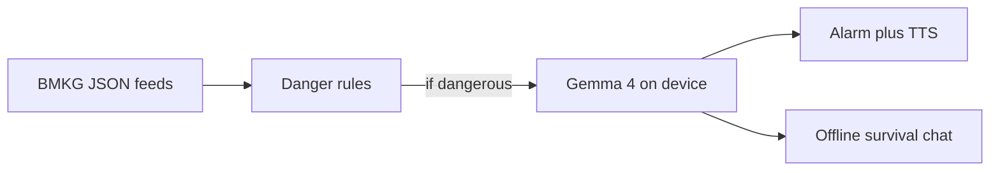

# Prometheus

On-device disaster awareness for Indonesia. The app combines **BMKG open data** with **Gemma 4** running locally on the phone: when a dangerous event is detected, it can **alert you**, then **speak concise rescue and safety guidance** grounded in the hazard context and shaped by Gemma’s reasoning. A separate **offline survival assistant** uses the same model with a fixed system prompt focused on survival skills and risk reduction.

Built by **Team Gravity Falls** for the Google Gemma hackathon — May 2026.

**Scope change:** The previous **book-reading / RAG library** direction is **cancelled**. Survival help moves to **BMKG-driven alerts + Gemma 4** (no per-query book retrieval pipeline as the primary product).

## What it does (target)

| Capability | Description |
|------------|-------------|
| BMKG monitoring | Poll or refresh BMKG open JSON feeds (earthquakes and related fields). Classify **dangerous** events (e.g. magnitude threshold, felt intensity, tsunami potential — rules TBD in app). |
| Danger alarm | On a dangerous classification: **audible alarm** + **spoken briefing** (TTS) with **what happened**, **what to do now**, and **what to avoid**, using Gemma 4 with a dedicated **emergency** system prompt and structured hazard context from BMKG. |
| Offline survival chat | **Gemma 4 on device** with a **survival-focused system prompt** (first aid, shelter, water, evacuation mindset, Indonesia-relevant hazards). Works **offline** after the model is downloaded. |

## Team Gravity Falls

| Person | Responsibility |
|--------|------------------|
| **Pelangi** | iOS app: SwiftUI, BMKG polling + local rules, alarms, TTS playback, wiring Gemma conversations (chat vs emergency), permissions, and on-device UX. |
| **Andi** | BMKG integration: endpoints, update cadence, attribution, parsing and **danger classification** contract (what JSON fields mean, thresholds, tests against live/sample payloads). |
| **Arund** | Gemma 4 behavior: **system prompts** (survival chat vs emergency briefing), prompt safety, length limits for voice, and evaluation of model outputs for crisis use. |

## Tech stack (directional)

| Layer | Technology |
|-------|------------|
| App | Swift + SwiftUI (existing project under `prometheus-app/`) |
| Hazard data | BMKG open JSON (see `config/bmkg_endpoints.json`) |
| On-device LLM | Gemma 4 (e.g. LiteRT LM — already used in the app) |
| Voice output | Apple `AVSpeechSynthesizer` (or equivalent) for briefings |
| Alerts | Local notifications + in-app alarm audio (exact stack TBD in app) |

## Repository layout

| Path | Purpose |
|------|---------|
| `prometheus-app/` | **Xcode project — owned by Pelangi for app work;** do not refactor here until the team aligns on the upgrade. |
| `config/` | Shared **prompts** and **BMKG endpoint** references for app and tooling. |
| `tools/` | Small scripts (e.g. sample BMKG fetch) for integration testing without the simulator. |
| `src/chunking/` | **Legacy** book ingestion pipeline; kept for reference only — **not** the main product path. |
| `book/` | **Legacy** extracted book JSON; **not** required for the BMKG + Gemma upgrade. |

## Quick start (repo)

1. Clone the repository.
2. **App:** Open `prometheus-app/prometheus-app.xcodeproj` in Xcode when you are ready to work on the iOS target (model download and device requirements stay as in the existing app docs, if any).
3. **BMKG smoke check:** From the repo root, with Python 3 installed:  
   `python tools/fetch_bmkg_autogempa.py`  
   Prints the latest `autogempa` payload summary (for Andi’s integration tests).

## BMKG (short reference)

Indonesia’s Meteorology, Climatology, and Geophysics Agency publishes **open earthquake feeds** in JSON. Example family of URLs (verify in production and respect BMKG terms of use and attribution):

- `https://data.bmkg.go.id/DataMKG/TEWS/autogempa.json` — latest event  
- `https://data.bmkg.go.id/DataMKG/TEWS/gempaterkini.json` — recent list (often M 5.0+)  
- `https://data.bmkg.go.id/DataMKG/TEWS/gempadirasakan.json` — felt events  

Always **credit BMKG** in the app and docs. Full field mapping and “dangerous” rules belong in app + Andi’s integration notes.

## Architecture (high level)

## Roadmap (non-app work first)

- [x] README and shared `config/` + `tools/` for BMKG and prompts  
- [ ] Andi: finalize danger rules and sample fixtures  
- [ ] Arund: lock emergency vs chat prompts and max tokens for voice  
- [ ] Pelangi: integrate feeds, alarm path, and dual conversation modes in the app  

---

*Hackathon project — not a substitute for official emergency instructions or BMKG warnings.*
